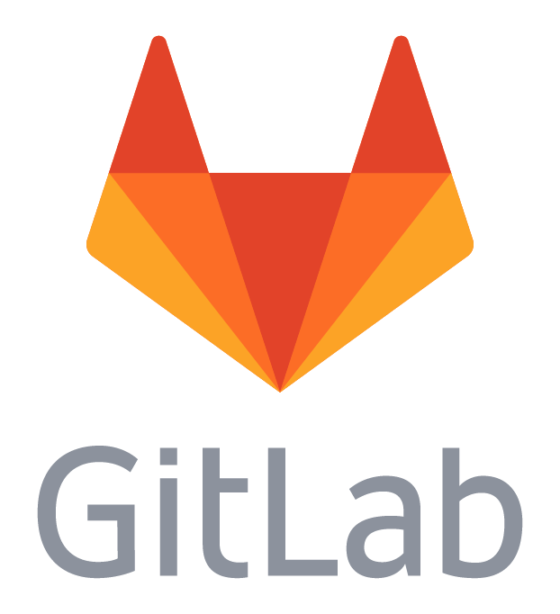

### Hi there 👋

  
  

    <strong>Tale about one stubborn guy</strong> (2 minutes read)
  

   
  Once upon a time, there was a tiny 👶 baby boy. His name was Misha. 
  Since he started walking, a great passion for 💻computers lived inside this little kid. 
  Years were passing by, Misha was growing, and his curiosity grew with him. 

  When the kid reached 14, he decided to find out how is it — to be a programmer 👨‍💻 
  
  It was difficult for this curious guy to learn the craft of programming 😣 
  as he was born and lived in a tiny village where people used to think that programmers are just some special sub kind of magicians. 
  He just had nobody to discuss his interests with. Nobody could help when it was hard. Nobody could understand him.... 🥺 
  But Misha never gave up and was following his dream!

  Day by day he was overcoming hard deadlocks that seemed hopeless until the efforts gave their first harvest 🌱 
  The sun had come out from behind the clouds — the boy, at last, got a first job at the age of 16 👨‍💼 
  Misha was hired as Java Developer — just as he imagined it in his dreams ✨ 
  Succeeded boy understood that he is happy with his new great passion — programming.

  A lot of water has flowed under the bridge since Misha got his first job. 
  But one thing has always been and always will remain unchanged: success doesn't come to you... you go to it by yourself 🎯

  My name is Misha and this was a story of my youth.
  Thank you for reading!
  

<!---->
<!---->

<table>
  <!-- Row 0: About me label -->
  <tr>
    <td colspan="2" align="center">
      <strong>👤&nbsp; About me</strong> 
    </td>
  </tr>

  <!-- Column [1,2]. Row 1: Personal info -->
  <tr>
    <!-- Perfonal info: Left column -->
    <td>
       
      👨&nbsp; 25 y.o. Java/Kotlin Senior Software Engineer 
       
      🛠️&nbsp; 7+ years of production experience (Java/Kotlin) 
      &nbsp;&nbsp;&nbsp; 
       
      📝&nbsp; <a href="https://bit.ly/3dt2rrX">Oracle</a> & <a href="https://bit.ly/3mCFHam">Huawei</a> certified professional 
      &nbsp;&nbsp;&nbsp; 
       
      <strong>🔗&nbsp; Feel free to contact me</strong> 
      <a href="https://t.me/pihanya">
      <a href="https://www.linkedin.com/in/pihanya/">
    </td>
    <!-- Perfonal info: Right column -->
    <td align>
       
      🏆&nbsp; Fond of hackathons and winning them 
       
      🎓&nbsp; Master's degree <a href="https://en.wikipedia.org/wiki/ITMO_University">ITMO University</a>, 
      &nbsp;&nbsp;&nbsp;&nbsp;&nbsp;&nbsp;&nbsp;Saint Petersburg, Russia 
       
      🚀&nbsp; Interested in AI and stock market analytics 
      &nbsp;&nbsp;&nbsp; 
      &nbsp;&nbsp;&nbsp; 
      &nbsp;&nbsp;&nbsp; 
      &nbsp;&nbsp;&nbsp; 
      &nbsp;&nbsp;&nbsp; 
    </td>
  </tr>

  <tr>
    <!-- Column 1. Row [2,3]: ⚙️ Engineering on... -->
    <td rowspan="2" align="center">
      
    </td>
    <!-- Column 1. Row 3: Noticeable projects label -->
    <td><strong>👏&nbsp; Noticeable projects</strong></td>
  </tr>

  <!--  Column 2. Row 3: Noticeable projects repos   -->
  <tr>
    <!-- Pihanya/forthress -->
    <td>
      
       
      <!-- Pihanya/olimp-java -->
      
    </td>
  </tr>

  <!-- Column [1,2]. Row 5: Contributions label -->
  <tr>
    <td colspan="2" align="center">
      <strong>✨&nbsp; Contributions</strong> 
    </td>
  </tr>
  <!-- Column [1,2]. Row 6: Contributions list -->
  <tr>
    <td align="center">
      <!-- Contribution: gitlab-org/gitlab -->
      
      <!--&nbsp;&nbsp;&nbsp;-->
    </td>
    <td align="center">
      <!-- Contribution: Kotlin/kotlinx.coroutines -->
      
    </td>
  </tr>
</table>
